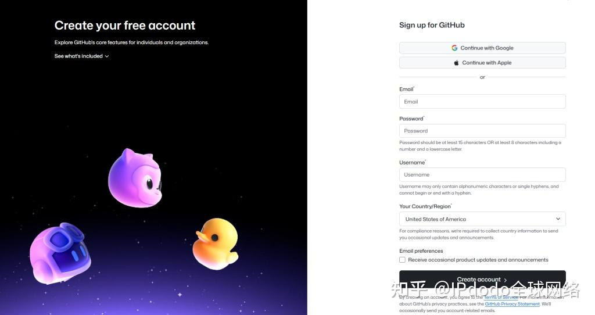
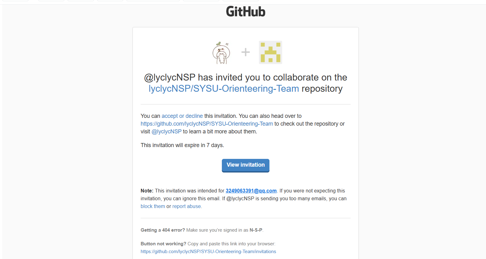
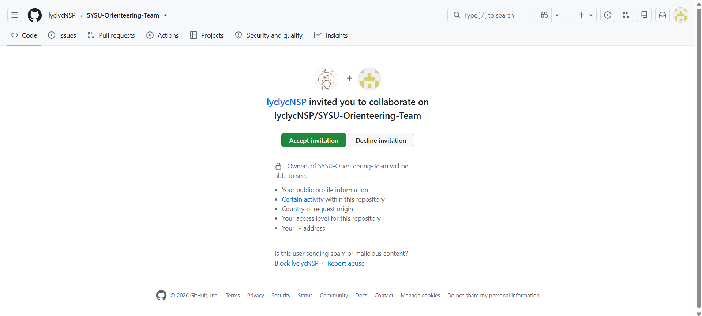
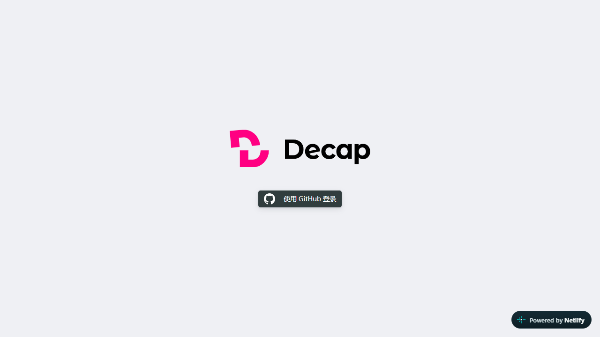
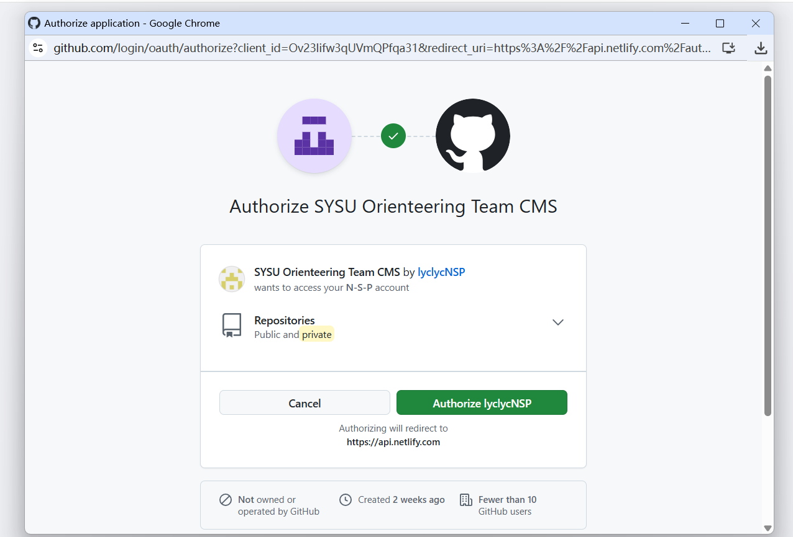
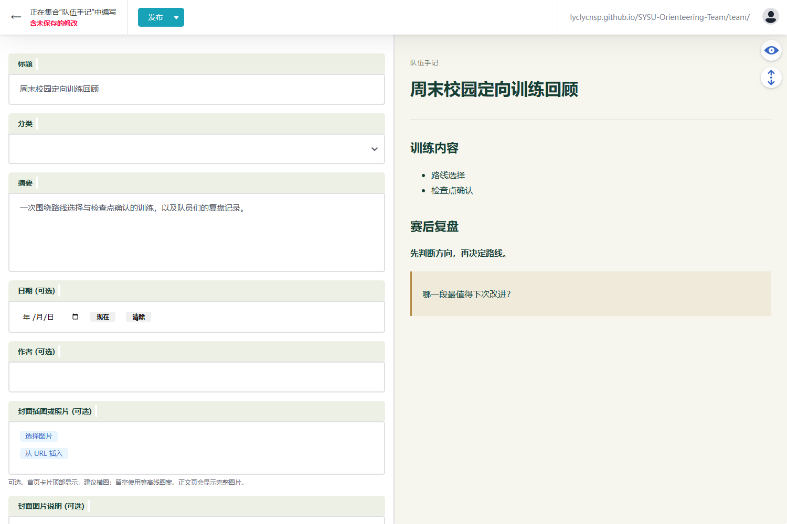
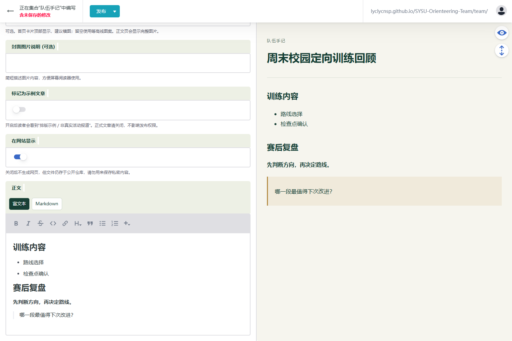
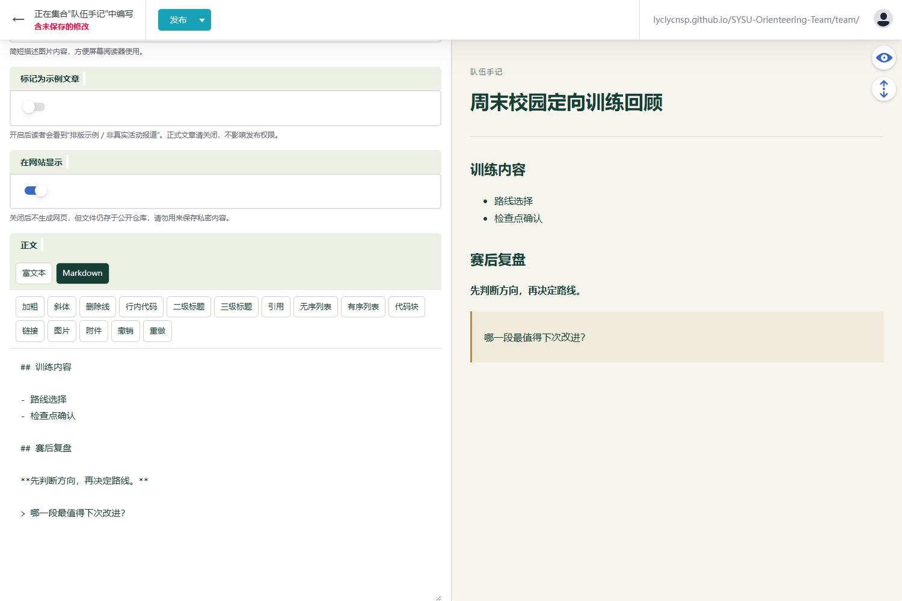

# 中山大学定向队官网：后台编辑教程

适用对象：负责训练回顾、比赛推文、队伍规程和资料维护的同学。无需安装 Git、编写 HTML 或在本地推送文件，使用电脑浏览器即可完成日常编辑。

## 1. 先收藏两个入口

| 用途 | 地址 |
| --- | --- |
| 写文章、上传图片和附件 | [编辑后台（Decap CMS）](https://sysu-orienteering-team.netlify.app/admin/) |
| 查看发布结果、文章呈现效果 | [队伍网站首页](https://lyclycnsp.github.io/SYSU-Orienteering-Team/team/) |

**在 Netlify 后台写，在 GitHub Pages 网站看。** 日常发布不需要进入 Netlify 控制台，也不需要自己点部署。

## 2. 第一次使用：注册 GitHub

已有 GitHub 账号的同学直接使用原账号。可直接跳转第3节内容，没有 Github 账号的同学继续往下阅读。

1. 打开 [GitHub 注册页](https://github.com/signup)。
2. 按提示填写邮箱、密码和用户名，完成页面验证。


图 1：注册页面，按照页面信息填写后创建账号。

3. 查看注册邮箱，完成邮箱验证。普通免费个人账号即可，不必购买付费套餐。
4. 记下自己的 **GitHub 用户名**。例如个人主页是 `https://github.com/yourname`，用户名就是 `yourname`，不一定等于页面上显示的昵称。

注册步骤如有界面变化，以 GitHub 页面提示为准。参见 [GitHub 官方注册说明](https://docs.github.com/en/account-and-profile/how-tos/account-management/creating-an-account-on-github)。

## 3. 获取权限并“绑定账号”

这里的绑定分成两步：**管理员邀请你加入仓库；你首次登录时授权后台使用 GitHub 账号。** 不需要另外注册 Decap 或 Netlify 账号。

### 第一步：接受管理员邀请

1. 把 GitHub 用户名或个人主页链接发给网站管理员。
2. 管理员将你加入 `lyclycNSP/SYSU-Orienteering-Team` 仓库的协作者。

3. 用被邀请的账号登录 GitHub，打开邮件中的邀请链接或管理员提供的邀请链接，点击接受（Accept invitation）。



图 2：邮箱中收到邀请的界面，点击后跳转到 Github。



图 3：Github 中收到邀请的界面，点击 Accept invitation 接受邀请。

4. 告知管理员已接受，然后进入编辑后台。

仅能打开仓库页面不代表已有编辑权限，因为仓库本身是公开的。后台编辑需要仓库写入权限，这是本网站采用的 [Decap GitHub 登录方式](https://decapcms.org/docs/github-backend/) 的要求。

**给管理员：** 在 [仓库设置](https://github.com/lyclycNSP/SYSU-Orienteering-Team/settings/access) 的 Collaborators 中添加同学，确认对方接受邀请。邀请由管理员操作，编辑同学不必寻找这个设置。协作者权限覆盖仓库，日常请通过后台维护内容，避免误改网站程序。

### 第二步：首次授权登录

1. 打开 [编辑后台](https://sysu-orienteering-team.netlify.app/admin/)。
2. 点击“使用 GitHub 登录”（界面也可能显示 Login with GitHub）。



图 4：正式后台的登录入口。先接受仓库邀请，再点击按钮登录。

3. 在弹出的 GitHub 页面登录刚才接受邀请的账号。
4. 首次使用可能出现授权页面。确认是从队伍后台发起的登录、应用由管理员配置后，点击授权（Authorize lyclycNSP）。应用名称（SYSU Orienteering Team CMS）以管理员配置为准；不确定时把应用名称发给管理员核对。



图 5：授权验证入口。点击授权（Authorize lyclycNSP）。

5. 授权完成后返回后台，能看到“规章制度”“比赛故事”“资料下载”等栏目，即可开始编辑。

以后通常直接点击 GitHub 登录即可。不要向管理员发送密码、邮箱验证码或访问令牌，也不需要自己创建 OAuth App、填写 Client Secret。


## 4. 写第一篇文章

进入“比赛故事”，点击“+文章”；修改已有文章时，直接打开对应条目。



图 6：先填写左侧字段，再向下滚动编辑正文。图中分类尚未选择，正式发布前须补全。以下编辑截图均来自本地演示，示例文章没有发布。

| 字段 | 怎么填写 |
| --- | --- |
| 标题 | 简明说明活动或文章主题，例如“周末校园定向训练回顾” |
| 分类 | 按内容选“训练回顾”“比赛故事”或“入门资料” |
| 摘要 | 用一两句话介绍内容，会显示在首页卡片中 |
| 日期、作者 | 填活动或文章日期，以及撰稿人 |
| 封面插图或照片 | 可上传照片或插图；建议横图，主体放在画面中间，首页会裁剪显示 |
| 封面图片说明 | 简短描述画面，如“队员在终点合影” |
| 标记为示例文章 | 正式文章关闭；开启会显示“排版示例 / 非真实活动报道”提示 |
| 在网站显示 | 正式发布通常开启；关闭后不在网站生成文章页面 |
| 正文 | 填写文章内容，标题已经单独填写，正文可以直接从导语开始 |

“在网站显示”关闭不等于私密草稿：发布后内容仍会进入公开仓库。目前没有配置“提交后必须经管理员审核”的流程，点击发布前请自行完成校对。尚未定稿的内容建议另存本地文档，不要把未提交的编辑页面当作可靠备份。

### 富文本与 Markdown 怎么选

- **富文本**：适合大多数同学，像普通文档一样写字，选中文字后点击上方格式按钮。
- **Markdown**：适合希望直接控制标题、列表、链接的同学，也支持上方快捷按钮，不必背下全部语法。

正文上方可以切换两种模式，右侧预览用来检查排版。切换会保留正文，但可能整理空行等写法，并清空当前模式的撤销记录；复杂内容尽量在一种模式下写完。最终首页卡片和导航以正式网站为准。



图 7：富文本模式直接显示排版。选中文字后点击格式按钮；“＋”可插入附件等组件。

## 5. 图片、附件与下载资料

### 给文章插入图片

1. 将光标放在正文需要插图的位置。
2. 点击工具栏的图片按钮，上传图片或从媒体库选择。
3. 选择图片并确认插入，在右侧检查显示效果。

媒体库中的“草稿”表示图片尚未随内容发布，不是上传失败；本后台支持未发布图片的预览。不要为了预览自行把图片路径替换成浏览器中的临时地址或线上完整网址。

封面图和正文图是两个位置：只设置封面，不代表正文相同位置也插入了图片。上传前建议给图片起易识别的名称，避免用同名文件覆盖其他文章正在使用的图片。

### 给正文插入 PDF、Word 等附件

- Markdown 模式：点击附件按钮，上传或选择文件，确认插入下载链接。
- 富文本模式：在“添加组件（＋）→ 附件下载”中选择文件，并填写链接文字。

附件会以可点击的链接呈现，通常不会像图片那样直接展示完整文档。

### 更新全站“资料下载”栏目

打开“资料下载 → 下载资料列表”，增加一个资料条目，填写资料名称、说明、下载按钮文字，并在“文件”字段上传或选择附件。“在线阅读地址”可选，有对应网页时再填。

只添加本次需要的条目，不要误删原有指南或检查点说明。修改后同样需要发布，再到正式网站验证下载。

### 发布队伍规程

打开“队伍规程”，新建一篇规程文章。此栏目支持多篇文章，不必把所有规则都堆进同一篇；填写标题、简介、日期、发布单位和正文即可。

## 6. 够用的 Markdown 速查

Markdown 是用少量符号表示排版的纯文本写法。**符号使用英文半角；标题、列表符号后留一个空格；段落之间留一个空行。**

[**供参考的 Markdown 教程，下文也会简要介绍**](https://markdown.com.cn/basic-syntax/)



图 8：左侧输入 Markdown，右侧查看效果。上方的中文快捷按钮可帮助插入语法；“图片”和“附件”按钮用于打开媒体库。

### 标题与段落

文章标题在上方字段填写，正文的小节通常从 `##` 开始：

```markdown
这次训练围绕路线选择和检查点确认展开。

## 训练安排

这里是一个段落。

这里是另一个段落。

### 路线选择练习

这里是更细一级的内容。
```

### 强调、列表和引用

```markdown
集合时间：**周六 08:30**。

*这里可以写简短补充说明。*

需要携带：

- 指北针
- 饮用水
- 适合跑步的鞋服

训练流程：

1. 集合与热身
2. 分组出发
3. 赛后复盘

> 复盘问题：这一段路线为什么这样选择？
```

### 链接、图片与附件

```markdown
[查看队伍网站](https://lyclycnsp.github.io/SYSU-Orienteering-Team/team/)


[下载训练说明](<uploads/训练说明.pdf>)
```

格式中，方括号里是链接文字或图片说明，圆括号里是网址或路径。图片比普通链接多一个开头的 `!`。图片与附件优先用工具栏插入，示例路径需换成媒体库中的实际文件，不要直接粘贴示例后期待文件存在。

### 简单表格

```markdown
| 环节 | 时间 | 地点 |
| --- | --- | --- |
| 集合 | 08:30 | 体育场 |
| 复盘 | 10:00 | 终点区 |
```

表格适合简短安排，长篇复盘用段落更易阅读。无需写 HTML 或代码块来控制普通文章排版。

### 可直接改写的训练回顾正文

将以下内容复制到正文的 Markdown 模式，再替换为真实记录。代码框外的标题、摘要等字段仍需单独填写。

```markdown
本次训练于【日期】在【地点】进行，主要练习【训练目标】。

## 训练内容

- 【练习一】
- 【练习二】

## 路线与复盘

### 一次值得记录的路线选择

【描述当时的判断、实际结果，以及下次可以怎样改进。】

## 队员感想

> 【经本人确认可以公开的感想。】

## 下次训练的改进

1. 【具体改进一】
2. 【具体改进二】
```

## 7. 发布与检查

1. 核对标题、日期、人名、比赛成绩和正文，确认示例标记已关闭。
2. 在预览中检查标题层级、图片及附件文字；不要公开个人联系方式等不适合公开的信息。
3. 点击发布，并按页面提示完成确认。等待成功提示，发布完成前不要关闭页面。
4. 打开 [队伍网站首页](https://lyclycnsp.github.io/SYSU-Orienteering-Team/team/)，等待自动构建完成后刷新。更新不是即时的。
5. 打开文章，检查封面、正文图和下载链接，再复制正式文章网址分享。

修改已有文章也是“打开 → 修改 → 发布 → 查看正式网站”。多人协作时先约定每篇文章的负责人，避免同时修改同一篇导致覆盖或冲突。

如果管理员已上线 Netlify 跳过构建规则，内容发布后只更新 GitHub Pages 是正常现象；不要用 Netlify 域名下的文章副本判断是否发布成功。写作和登录方式不受这项优化影响。

## 8. 遇到问题先看这里

| 问题 | 处理方法 |
| --- | --- |
| 能登录 GitHub，但后台提示无权限 | 确认使用了接受仓库邀请的同一个账号；请管理员确认邀请已接受且权限有效 |
| 点击登录没有弹出窗口 | 检查浏览器是否拦截弹窗；建议在电脑浏览器直接打开后台，不在微信内置浏览器操作 |
| GitHub 或登录页面一直加载 | 先单独打开 GitHub 确认网络是否可用；必要时更换网络，再重试，不要反复注册账号 |
| 媒体库图片显示“草稿” | 先选择并插入，在右侧预览；这通常只表示尚未发布 |
| 插入后预览不显示图片 | 检查是否已确认选择、路径是否被手动修改；先备份正文再重试，仍失败时把截图发给管理员 |
| 发布成功，但网站暂时没变 | 确认查看的是 GitHub Pages 正式网址；等待并刷新，持续未更新则请管理员检查 Actions |
| 图片或下载链接发布后打不开 | 检查文件是否随文章成功发布、是否被重命名或删除，必要时重新从媒体库选择 |
| 误改文章或删除内容 | 及时联系管理员，提供文章标题和大致操作时间；仓库历史通常可用于恢复，避免继续反复覆盖 |

反馈问题时附上：操作入口、文章标题、执行了哪一步、错误截图。不要附密码、验证码或授权凭据。
